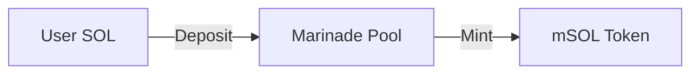
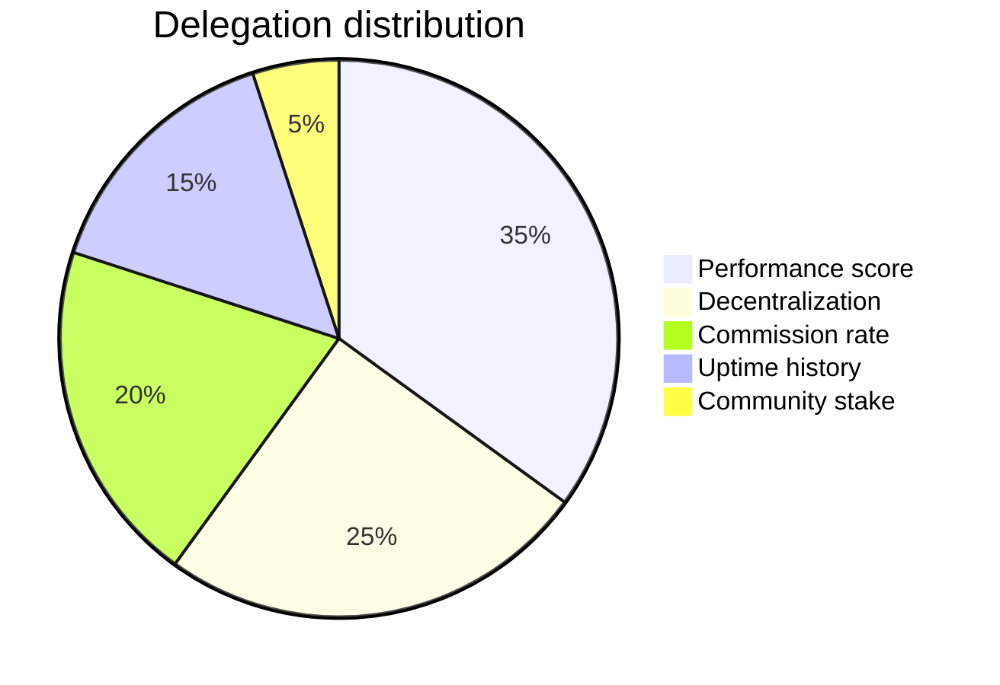

# Diagrams and Charts

## Mermaid Diagrams

Approaches ranked by reliability:

### Approach 1: Inline Mermaid code blocks

Source of truth for diagram content. Renders as code in Marp:

````markdown

````

### Approach 2: beautiful-mermaid color-mix() pattern

Inspired by [beautiful-mermaid](https://github.com/lukilabs/beautiful-mermaid), derive all diagram colors from two base variables:

```css
/* Marinade Mermaid base vars */
--bg: #EDF5F3;   /* slide background (light-teal) */
--fg: #194544;   /* deep teal foreground */

/* Derived palette via color-mix() */
Node fill:    color-mix(in srgb, var(--fg) 8%, var(--bg))   /* very subtle tint */
Node stroke:  color-mix(in srgb, var(--fg) 25%, var(--bg))  /* visible border */
Edge lines:   color-mix(in srgb, var(--fg) 50%, var(--bg))  /* medium contrast */
Edge labels:  color-mix(in srgb, var(--fg) 40%, var(--bg))  /* readable labels */
Arrow heads:  color-mix(in srgb, var(--fg) 85%, var(--bg))  /* strong accent */

/* Accent nodes use brand-teal directly */
Primary node:   fill: #308D8A, stroke: #194544, color: #FFFFFF
Secondary node: fill: #94C9C8, stroke: #2B8784, color: #151A1A
Tertiary node:  fill: #447579, stroke: #194544, color: #FFFFFF
```

For dark slides (`--bg: #0c2a29`, `--fg: #94C9C8`), the same derivation produces a dark-mode diagram.

### Approach 3: Pre-rendered SVGs (for production output)

1. Generate diagrams at [mermaid.live](https://mermaid.live/) or use `mmdc` CLI
2. Apply Marinade brand colors in the Mermaid theme config:

```json
{
  "theme": "base",
  "themeVariables": {
    "primaryColor": "#308D8A",
    "primaryTextColor": "#FFFFFF",
    "primaryBorderColor": "#194544",
    "secondaryColor": "#94C9C8",
    "secondaryTextColor": "#151A1A",
    "secondaryBorderColor": "#2B8784",
    "tertiaryColor": "#447579",
    "tertiaryTextColor": "#FFFFFF",
    "tertiaryBorderColor": "#194544",
    "lineColor": "#308D8A",
    "textColor": "#151A1A",
    "mainBkg": "#308D8A",
    "nodeBorder": "#194544",
    "clusterBkg": "#F3F3F3",
    "clusterBorder": "#94C9C8",
    "titleColor": "#151A1A",
    "edgeLabelBackground": "#EDF5F3",
    "fontFamily": "DM Sans, sans-serif",
    "fontSize": "14px"
  }
}
```

3. Export as SVG, save to `diagrams/` folder
4. Embed in slides: ``

### Approach 4: Mermaid style directives (inline in code blocks)

When writing Mermaid code blocks for documentation or future rendering, always include Marinade brand styling:

```
style NodeName fill:#308D8A,stroke:#194544,color:#FFFFFF
style NodeName fill:#94C9C8,stroke:#2B8784,color:#151A1A
style NodeName fill:#447579,stroke:#194544,color:#FFFFFF
style NodeName fill:#59A9A7,stroke:#2B8784,color:#FFFFFF
style NodeName fill:#194544,stroke:#151A1A,color:#FFFFFF
style NodeName fill:#FFFFFF,stroke:#308D8A,color:#151A1A
```

## Mermaid Diagram Types for Presentations

| Diagram | Use case | Example |
|---------|----------|---------|
| `graph LR` | Process flows, staking flows | SOL -> Pool -> mSOL -> DeFi |
| `graph TB` | Architecture diagrams | Protocol layer stack |
| `pie` | Revenue/allocation breakdown | Revenue sources, delegation weights |
| `gantt` | Roadmap timelines | Quarterly milestones |
| `sequenceDiagram` | Transaction flows | Stake/unstake sequences |
| `classDiagram` | Smart contract structure | Program accounts |
| `stateDiagram-v2` | State machines | Stake account lifecycle |

## CSS-Only Charts

```html
<div class="bar-chart">
  <div class="bar" style="height:30%">
    <span class="bar-label">$420M</span>
    <span class="bar-cat">Q2 '24</span>
  </div>
  <div class="bar" style="height:60%">
    <span class="bar-label">$1.2B</span>
    <span class="bar-cat">Q4 '24</span>
  </div>
  <div class="bar" style="height:100%">
    <span class="bar-label">$2.1B</span>
    <span class="bar-cat">Q3 '25</span>
  </div>
</div>
```

Bar fill color: `#94C9C8` (light-teal). Labels: `#82B7B7` (chart-teal). No gridlines, no axis lines — data speaks for itself.

## Pie Charts via Mermaid



Use the Marinade teal spectrum for slices. Max 5-6 slices for readability.

## Chart Color Sequence

When creating any chart or diagram, use colors in this order:
1. `#308D8A` (brand-teal) — primary data
2. `#94C9C8` (light-teal) — secondary data
3. `#447579` (muted-teal) — tertiary
4. `#59A9A7` (soft-teal) — quaternary
5. `#194544` (deep-teal) — quinary
6. `#82B7B7` (chart-teal) — annotations/labels

## Tables as Data Visualization

Marp renders Markdown tables with the Marinade theme styling. Use tables for competitive comparisons, feature matrices, and metric summaries:

```markdown
| Metric | Q1 | Q2 | Q3 | Q4 |
|--------|----|----|----|----|
| **TVL** | $1.2B | $1.5B | $1.8B | $2.1B |
| **APY** | 7.2% | 7.8% | 8.3% | 8.81% |
```

Tables use `font-variant-numeric: tabular-nums` for aligned numbers. Header border is `#308D8A`.
