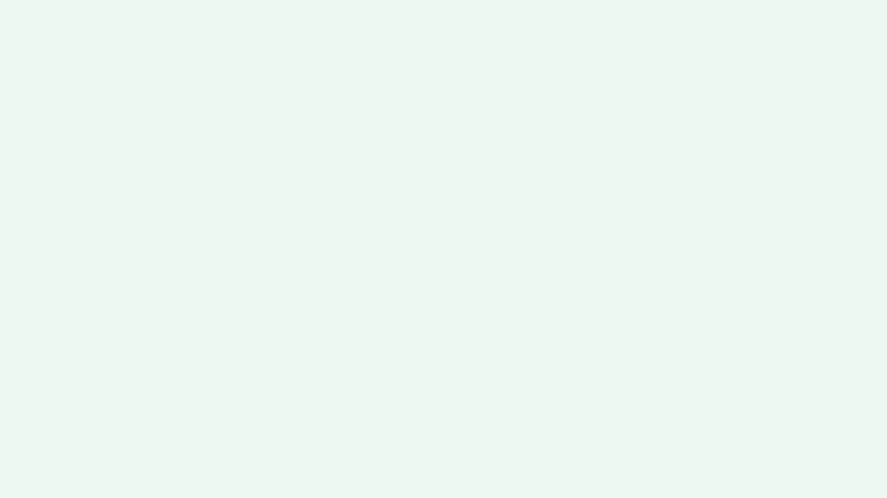

# Marp Implementation

[Marp](https://marp.app/) is the primary Markdown-based presentation format. A custom `marinade.css` theme enforces the brand system.

## Project Structure

```
<project>/
  slides/deck.md          # Presentation markdown
  themes/marinade.css      # Custom Marp theme
  assets/
    logos/                 # marinade-logo.svg, marinade-icon.png, marinade-hat.svg
    icons/                 # checkmark.png, pie-chart.png, qr-code-small.png
    backgrounds/           # teal-gradient.png, deep-teal-solid.png, light-teal-solid.png
  diagrams/                # Pre-rendered SVG diagrams
  dist/                    # Build output
  package.json
```

## Frontmatter

```yaml
---
marp: true
theme: marinade
paginate: true
header: ''
footer: ''
---
```

## Slide Class Variants

Use `<!-- _class: variant -->` directives to switch slide styles:

| Class | Usage | Background | Text |
|-------|-------|------------|------|
| `lead` | Title/cover, centered | White | Dark |
| `invert` | Dark emphasis | `#151A1A` | White/light-teal |
| `teal` | Brand accent | `#194544` | White/light-teal |
| `statement` | Large centered statements | White | Dark, 600 weight |
| `cover` | Full-bleed background | Image | White with shadow |
| `split` | Two-column content | White | Dark |
| `compact` | Dense content (22px base) | White | Dark |
| `dense` | Maximum density (18px base) | White | Dark |

Combine classes: `<!-- _class: lead teal -->` for centered teal title.

Use `_` prefix for spot directives (single slide only):
- `<!-- _paginate: false -->` — hide page number
- `<!-- _header: '' -->` — hide header
- `<!-- _footer: '' -->` — hide footer

## HTML Utility Classes

Since Marp supports `--html`, use these utility classes in slides:

```html
<!-- Metrics -->
<div class="metric">$2.1B</div>
<div class="metric-label">Total value locked</div>
<div class="metric metric-teal">8.81%</div>

<!-- Tags -->
<span class="tag">Category</span>
<span class="tag-teal">Active</span>

<!-- Layouts -->
<div class="columns">...</div>      <!-- 2-column grid -->
<div class="columns-3">...</div>    <!-- 3-column grid -->

<!-- Cards -->
<div class="card">
  <div class="step-num">1</div>
  <h3>Title</h3>
  <p>Description</p>
</div>

<!-- Lucide icons (inline SVG in Marp HTML) -->
<!-- Copy SVG from https://lucide.dev/icons/shield -->
<svg xmlns="http://www.w3.org/2000/svg" width="24" height="24" viewBox="0 0 24 24" fill="none" stroke="#308D8A" stroke-width="1.5" stroke-linecap="round" stroke-linejoin="round"><path d="M20 13c0 5-3.5 7.5-7.66 8.95a1 1 0 0 1-.67-.01C7.5 20.5 4 18 4 13V6a1 1 0 0 1 1-1c2 0 4.5-1.2 6.24-2.72a1.17 1.17 0 0 1 1.52 0C14.51 3.81 17 5 19 5a1 1 0 0 1 1 1z"/></svg>

<!-- Bar chart (CSS-only) -->
<div class="bar-chart">
  <div class="bar" style="height:60%">
    <span class="bar-label">$1.2B</span>
    <span class="bar-cat">Q4 '24</span>
  </div>
</div>

<!-- Timeline dots -->
<span class="dot"></span>          <!-- brand-teal -->
<span class="dot-light"></span>    <!-- light-teal -->

<!-- Accent word (PT Serif italic) -->
<span class="accent">positioning</span>

<!-- Logo row -->
<div class="logo-row">
   
</div>

<!-- Bento container (adapts to slide bg) -->
<div class="bento">
  <div class="metric">$2.1B</div>
  <div class="metric-label">Total value locked</div>
</div>

<!-- Subtle footnote -->
<div class="note">Supporting text here</div>

<!-- Highlight -->
<span class="highlight">key term</span>

<!-- Text size utilities -->
<span class="text-xs">0.55em</span>
<span class="text-sm">0.7em</span>
<span class="text-lg">1.15em</span>
<span class="text-xl">1.3em</span>
<span class="text-2xl">1.6em</span>
<span class="text-3xl">2em</span>
```

**Density classes** (apply via `<!-- _class: compact -->` or `<!-- _class: dense -->`):
- `compact` — 22px base, tighter padding. For tables, comparison slides.
- `dense` — 18px base, tightest padding. For data-heavy slides.

**Heading overrides** (combine with any class):
- `h-sm` — smaller headings (h1: 1.6em, h2: 1.2em)
- `h-lg` — larger headings (h1: 2.8em, h2: 2em)
- `h-xl` — display headings (h1: 3.2em, h2: 2.4em)

**Bento cards** adapt automatically: white bg + teal stroke on light slides, frosted glass on dark/teal slides.

## Build Commands

```bash
npm run build      # HTML -> dist/deck.html
npm run pdf        # PDF -> dist/deck.pdf
npm run pptx       # PPTX -> dist/deck.pptx
npm run preview    # Browser with live reload
npm run dev        # Watch mode
```

## Asset Paths

From within `slides/deck.md`, reference assets with relative paths:
```markdown


```

Marp image sizing: `` for width, `` for height, `` for background.

## Slide Background Assets

3 background images extracted from the master PPTX, bundled in the skill at `~/.claude/skills/marinade-brand-design/assets/backgrounds/`:

| File | Visual | Usage |
|------|--------|-------|
| `teal-gradient.png` | Teal-to-mint vertical gradient with subtle noise texture | Cover slides, title backgrounds. Auto-applied to `cover` class. |
| `deep-teal-solid.png` | Dark teal gradient into darker at bottom | Dark accent sections. Auto-applied to `teal` class. |
| `light-teal-solid.png` | Very light mint/teal solid | Subtle variation from white, section transitions. Manual `![bg]`. |

**Dark background** (`deep-teal-solid`): Auto-applied to `<!-- _class: teal -->`. Also works with `invert` class for white/light-teal text.

**Light background** (`light-teal-solid`): Keeps dark text readable. Use for subtle section breaks without going full-dark.

```markdown
<!-- Dark cover slide -->
<!-- _class: lead invert -->


# Your title here

---

<!-- Subtle light background -->


## Content with dark text
```

## Marp Generation Workflow

1. Copy frontmatter template, set theme to `marinade`
2. Map content to the 16 slide archetypes
3. Apply class variants per slide purpose
4. Use HTML utilities for metrics, cards, columns, charts
5. Add Mermaid blocks for diagrams (pre-render for production)
6. Reference assets with relative paths
7. Build (`npm run build`) and verify output
8. Export (`npm run pdf` / `npm run pptx`)

### Slide Pacing
- 1 key message per slide
- Max 6-7 content slides between section breaks
- Statement slides as section dividers
- Lead slides for opening and closing
- Alternate text-heavy and visual slides
