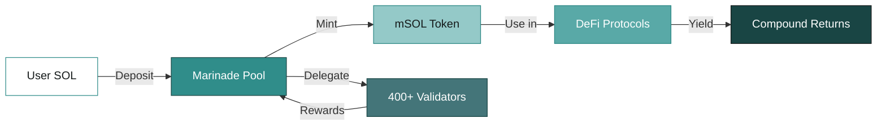
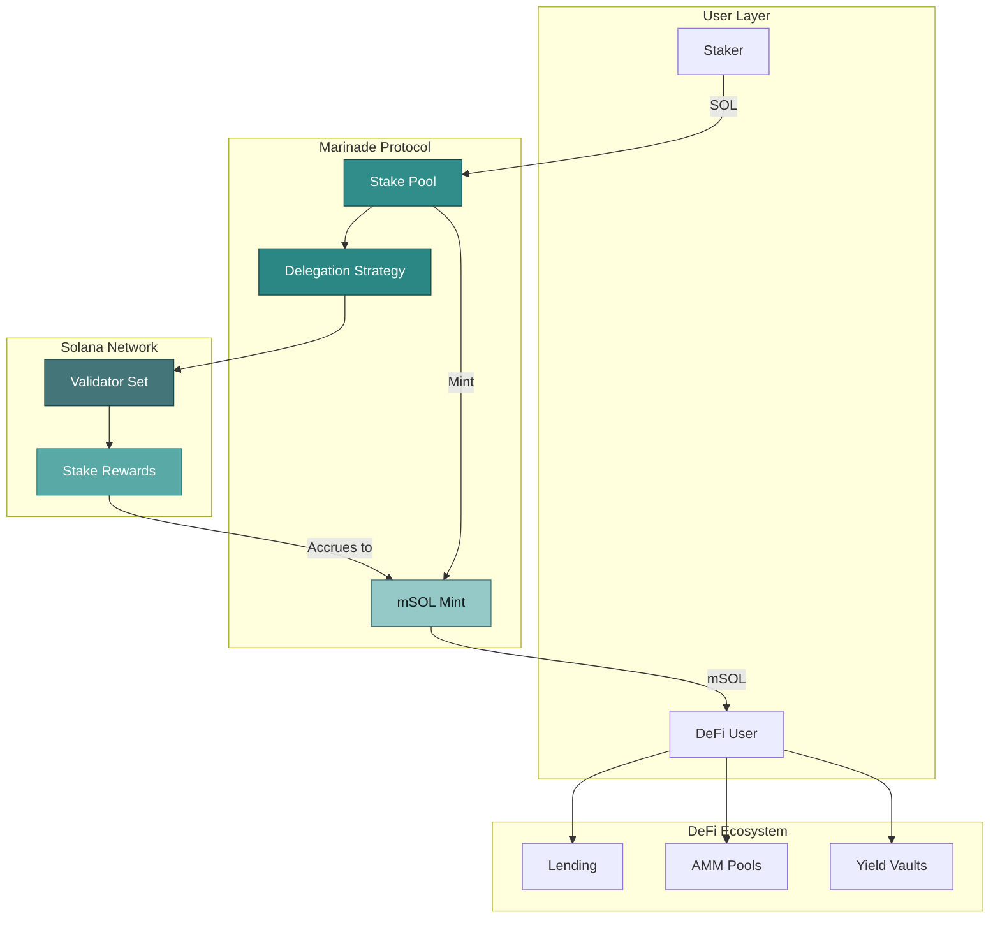
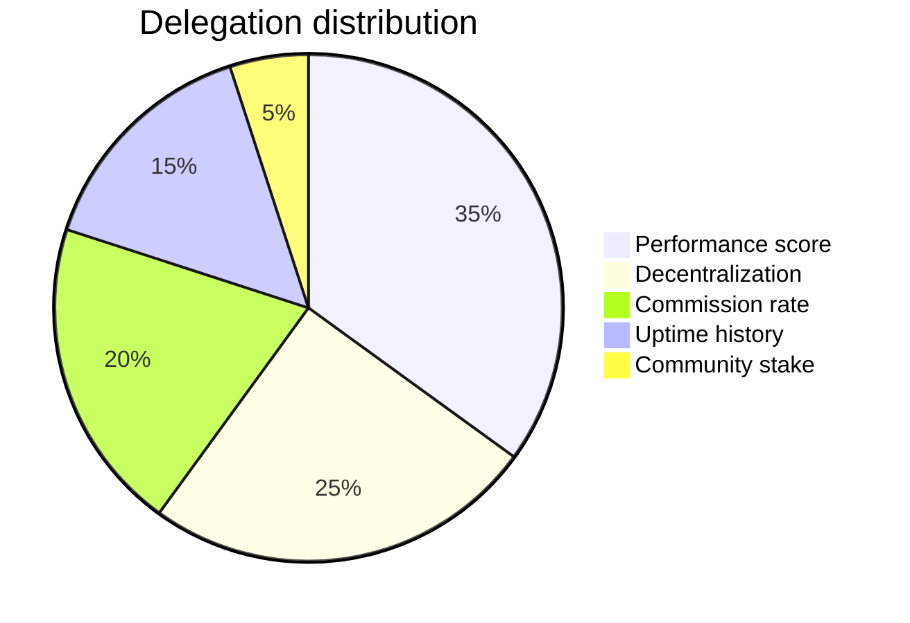
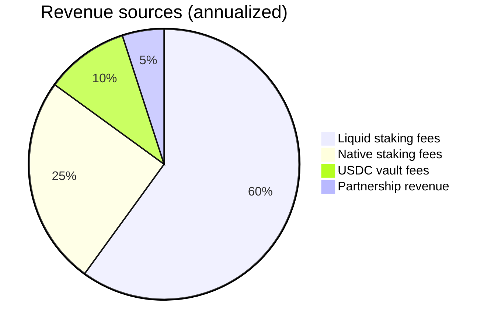

<!-- _class: lead -->
<!-- _paginate: false -->
<!-- _header: '' -->
<!-- _footer: '' -->

#### Investor update

# Marinade Finance
#### Q1 2026

---

<!-- _class: statement -->

# Solana's leading liquid staking protocol with 8.81% APY and $2.1B in total value locked

---

## The opportunity

Staking on Solana represents one of the largest yield opportunities in DeFi, yet **the majority of SOL remains unstaked** or locked in native validators without liquidity.

Marinade solves this by providing:

- **Liquid staking** — stake SOL, receive mSOL, stay liquid
- **Native staking** — delegate to 400+ validators, earn rewards
- **DeFi composability** — use mSOL across the Solana ecosystem

---

<!-- _class: split -->

## Key metrics

$2.1B

Total value locked

8.81%

Current APY

12.4M

SOL staked

400+

Validators in delegation strategy

---

## How Marinade works

1

<h3>Deposit SOL</h3>

Users deposit SOL into Marinade's staking pool or select native staking

2

<h3>Receive mSOL</h3>

Get liquid staking tokens that accrue value over time through staking rewards

3

<h3>Earn yield</h3>

Use mSOL in DeFi protocols while continuing to earn staking rewards

---

## Staking flow

Delegation strategy automatically rebalances across validators based on performance, commission, and decentralization metrics

---

## Protocol architecture

---

<!-- _class: teal -->

## Market sizing

$48B

TAM

Total staked SOL market cap

$12B

SAM

Liquid staking addressable market

$2.1B

SOM

Marinade current TVL

---

## TVL growth trajectory

$180MQ1 '24

$420MQ2 '24

$890MQ3 '24

$1.2BQ4 '24

$1.6BQ1 '25

$1.9BQ2 '25

$2.1BQ3 '25

Growth driven by native staking launch (Q2 '24) and DeFi integrations expansion

---

<!-- _class: compact -->

## Competitive *positioning*

|  | Marinade | Jito | Lido (wstETH) | Sanctum |
|---|---|---|---|---|
| **TVL** | $2.1B | $1.8B | $14B (ETH) | $800M |
| **Validators** | 400+ | 200+ | 30 | 300+ |
| **Liquid token** | mSOL | JitoSOL | wstETH | Various LSTs |
| **Native staking** | Yes | No | No | No |
| **Commission** | 2% | 4% | 10% | Varies |
| **Chain** | Solana | Solana | Ethereum | Solana |

Marinade is the only protocol offering both liquid and native staking with the broadest validator set

---

## Validator delegation strategy

The delegation strategy optimizes for **network health** while maximizing staker returns. Validators are scored across five weighted dimensions, with automatic rebalancing every epoch.

---

## Roadmap

### Completed

-  Native staking launch
-  400+ validator network
-  Governance v2
-  USDC vault beta

### Upcoming

-  Cross-chain mSOL bridging
-  Institutional custody support
-  Advanced delegation analytics
-  Mobile staking app

---

## Ecosystem partners

     

Integrated with **30+ DeFi protocols** across the Solana ecosystem for maximum mSOL composability

---

<!-- _class: invert -->
<!-- _class: lead invert -->

## Revenue model

2%

Staking commission

Applied to staking rewards earned by validators in the Marinade delegation strategy

$42M

Annual protocol revenue

Sustainable revenue directly tied to network staking activity and SOL price

---

## Revenue breakdown

---

<!-- _class: statement -->

#### Built on proven infrastructure

# Securing $2.1B in staked SOL across 400+ validators with zero slashing events

---

<!-- _class: lead teal -->
<!-- _paginate: false -->

# Start staking with Marinade

Visit **marinade.finance** to get started

marinade.finance | @MarinadeFinance | Discord

